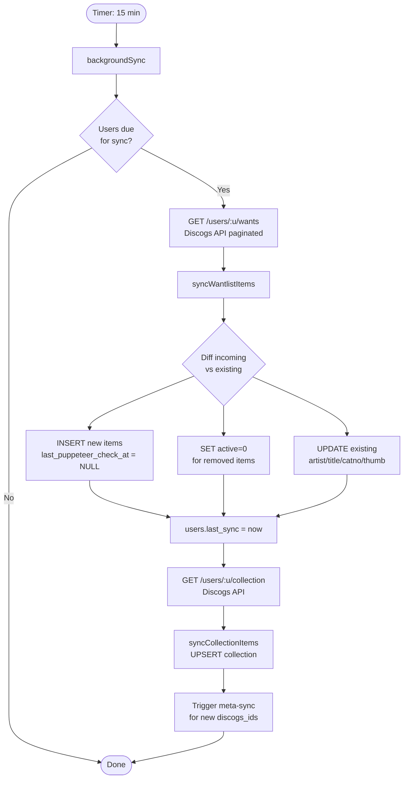
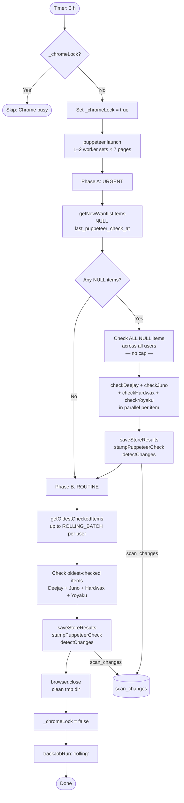
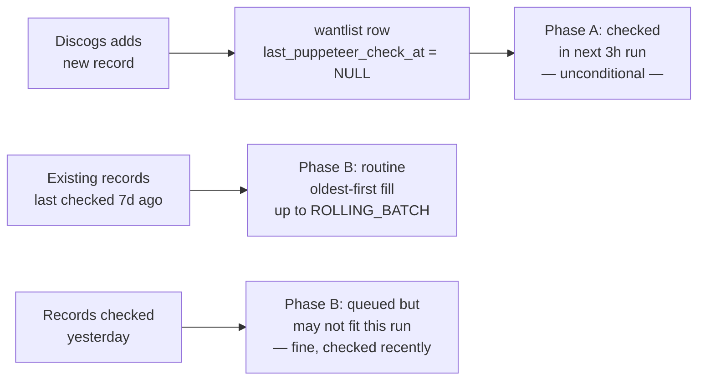
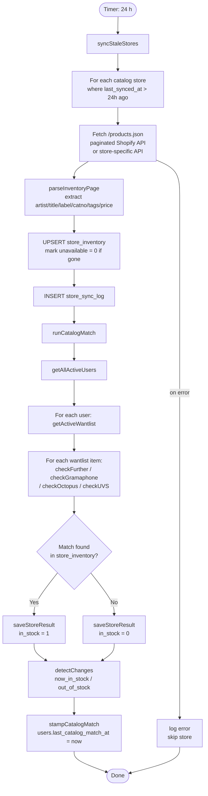
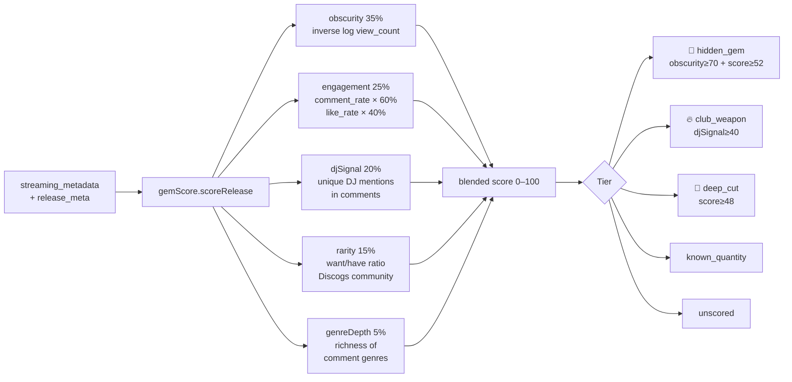
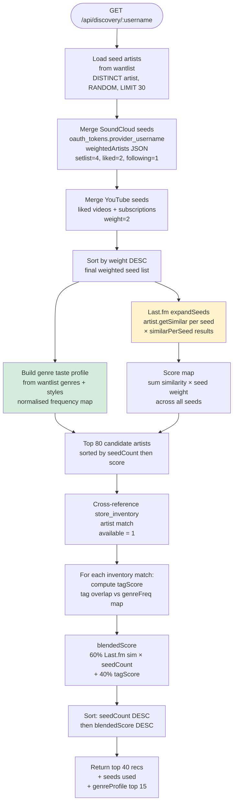
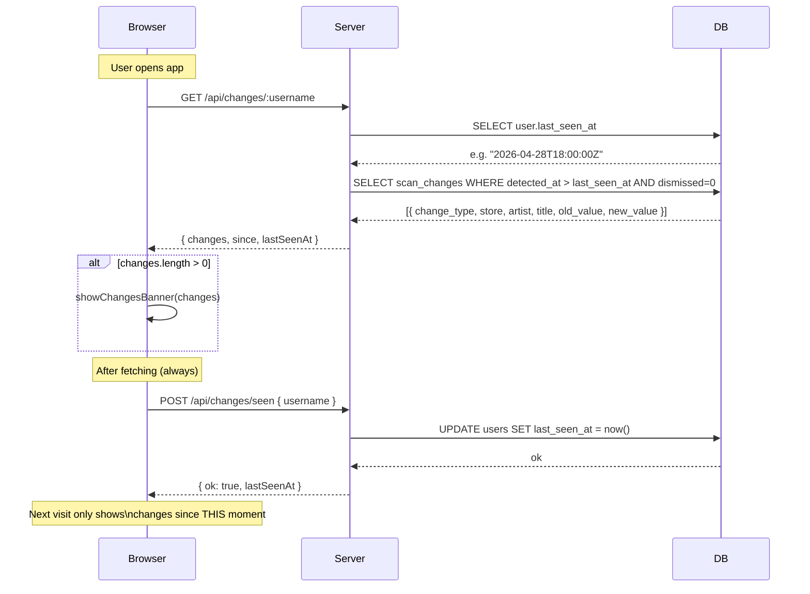
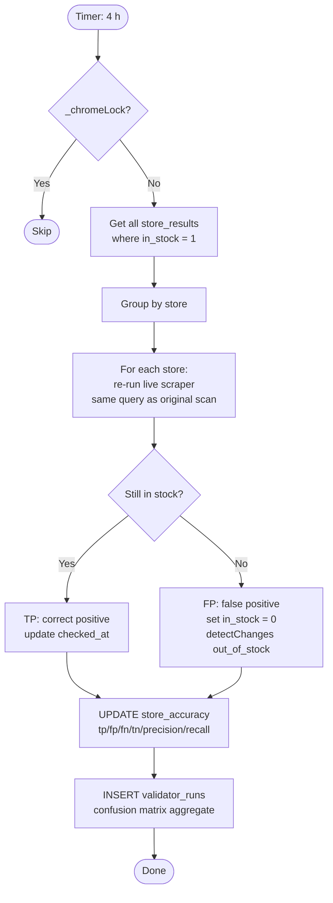

# Vinyl Checker — Pipeline Architecture

> **Node.js** · **SQLite (better-sqlite3)** · **Puppeteer** · **Last.fm API** · **YouTube Data API v3**
> **VPS:** 89.117.16.160 (Contabo, 12 GB RAM / 6 vCPU)
> App: PORT=5052, nginx proxy → `https://stream.ronautradio.la/vinyl/`

---

## Architecture Overview

```
┌─────────────────────────────────────────────────────────┐
│                       server.js                         │
│         (Express + setInterval job scheduler)           │
│                                                         │
│  Every 15 min  ──▶  Pipeline 1: Wantlist Sync           │
│  Every 3 h     ──▶  Pipeline 2: Rolling Puppeteer Scan  │
│  Every 24 h    ──▶  Pipeline 3: Catalog Sync + Match    │
│  Every 6 h     ──▶  Pipeline 4: YouTube Enrichment      │
│  Every 72 h    ──▶  Pipeline 5: Songstats Enrichment    │
│  Every 4 h     ──▶  Pipeline 6: Stock Validator         │
│  On-demand     ──▶  Pipeline 7: Discovery / Recommender │
└─────────────────────────────────────────────────────────┘
              │
              ▼
        vinyl-checker.db  (SQLite, WAL)
              │
              ▼
     public/js/app.js  (SPA, no framework)
```

---

## Pipeline 1 — Wantlist & Collection Sync

**Frequency:** Every 15 minutes per user (incremental diff)
**Source:** Discogs API · **Writes:** `wantlist`, `collection`, `users`



**Key behaviour:**
- New wantlist items get `last_puppeteer_check_at = NULL` → immediately queued for rolling scan
- Removed items are soft-deleted (`active = 0`), store_results retained for history
- Meta-sync runs inline: fetches `release_meta` (have/want/rating) + extracts Discogs video IDs

---

## Pipeline 2 — Rolling Puppeteer Scan

**Frequency:** Every 3 h (ROLLING_INTERVAL env var)
**Stores:** Deejay.de · Juno · Hardwax · Yoyaku (live Puppeteer scrapers)
**Writes:** `store_results`, `wantlist.last_puppeteer_check_at`, `scan_changes`



### FIFO Priority Queue



**Resource usage at current settings (ROLLING_WORKERS=1):**
- 1 Chrome browser · 7 idle tabs · 4 active scrapers per item pair
- RAM: ~200–350 MB · CPU: burst on navigation, idle between items
- Available: 10+ GB free on VPS → bump ROLLING_WORKERS=2 for 2× throughput

---

## Pipeline 3 — Catalog Sync + Catalog Match

**Frequency:** Every 24 h (DAILY_CHECK_INTERVAL)
**Stores:** Further Records · Octopus Records NYC · Gramaphone · Underground Vinyl (Shopify)
**Writes:** `store_inventory`, `store_sync_log`, `store_results`, `users.last_catalog_match_at`



**Key difference from Puppeteer scan:** Zero Chrome — pure SQLite lookups. Runs 1,614 items × 4 stores in ~10 seconds.

---

## Pipeline 4 — YouTube Enrichment

**Frequency:** Every 6 h · **Quota:** 7 API keys, ~80 calls/key/day
**Writes:** `streaming_metadata` (video_id, view/like/comment counts, comment_data JSON)

```mermaid
flowchart TD
    A([Timer: 6 h]) --> B[Get wantlist items\nwhere youtube_enriched_at IS NULL\nor older than 30 days]

    B --> C[Source 1: Discogs video extraction\nFREE — zero quota]
    C --> D{discogs_id has\nvideos[] in release?}
    D -- Yes --> E[Extract YouTube ID\nfrom Discogs video URL]
    D -- No --> F[Source 2: YouTube Search API\n100 units/search · 90 calls/key/day]
    E --> G[Validate ID format]
    F --> G

    G --> H[Batch stats: videos.list\n50 IDs per call = 1 unit\nview_count, like_count, comment_count]
    H --> I[commentThreads API\n1 unit per video\nTop 20 comments]
    I --> J[parseComments\nextract genres / DJs / era / sounds_like]
    J --> K[UPDATE streaming_metadata\nyoutube_enriched_at = now]

    K --> L[gemScore.scoreRelease\ncomputed on read\nnot stored]

    style C fill:#d4edda
    style F fill:#fff3cd
```

### Gem Score Formula (on-read, not stored)



---

## Pipeline 5 — Discovery / Recommender

**Trigger:** On-demand GET `/api/discovery/:username`
**Sources:** `wantlist` · `oauth_tokens` (SoundCloud, YouTube) · Last.fm API · `store_inventory`
**Returns:** Ranked recommendations with `because` (seed artists), `blendedScore`, `genreProfile`



---

## Pipeline 6 — "What's New Since You Left"

**Trigger:** User opens the app (GET `/api/changes/:username`)
**Writes:** `users.last_seen_at`



**Change types detected by `detectChanges()` in scanner.js:**

| `change_type` | Trigger |
|---|---|
| `now_in_stock` | `in_stock` flipped 0 → 1 |
| `out_of_stock` | `in_stock` flipped 1 → 0 |
| `price_drop` | Price decreased ≥ 5% |
| `price_increase` | Price increased ≥ 5% |

---

## Pipeline 7 — Stock Validator

**Frequency:** Every 4 h · **Purpose:** Re-verify items currently marked `in_stock=1`



---

## setInterval Schedule (server.js)

| Job | Interval | Env override | Notes |
|---|---|---|---|
| Wantlist sync | 15 min | `SYNC_INTERVAL` | Incremental diff |
| Rolling Puppeteer scan | 3 h | `ROLLING_INTERVAL` | Phase A (urgent) + Phase B (routine) |
| Catalog sync + match | 24 h | `DAILY_CHECK_INTERVAL` | No Chrome — pure SQLite |
| YouTube enrichment | 6 h | — | Quota-gated, 7 keys |
| Songstats enrichment | 72 h | — | 20 tracks/run |
| Stock validator | 4 h | — | Chrome, re-checks in_stock=1 |
| Meta-sync | inline | — | Piggybacks on wantlist sync |

**Startup sequence (after 5 min delay):**
1. Rolling Puppeteer scan (first batch)
2. Catalog sync → runCatalogMatch
3. YouTube enrichment pass

---

## Scaling Levers

| Lever | Current | Max (12 GB VPS) | How |
|---|---|---|---|
| ROLLING_WORKERS | 1 | 3 | `ROLLING_WORKERS=2` in env → 2 Chrome worker sets, check 2 items simultaneously |
| ROLLING_BATCH | 50/user/run | 150 | `ROLLING_BATCH=100` in env |
| ROLLING_INTERVAL | 3 h | 1 h | `ROLLING_INTERVAL=3600000` in env |
| Catalog stores | 4 | 4 | All Shopify-API stores already wired |
| Rolling scan stores | 4 | 6 | Add Decks.de (pages[5]) + Tracks & Layers (pages[4]) |
| seedLimit (discovery) | 30 seeds | 80 | `?seeds=60` query param |

**Effective cycle time** with ROLLING_WORKERS=2, ROLLING_BATCH=100, ROLLING_INTERVAL=3h:
- 6 users × 100 items × 3h = ~600 items/3h → full 1,614-item wantlist cycled every ~8 hours
