# Vinyl Checker — Database Schema

> **Production DB:** `vinyl-checker.db` (SQLite, WAL mode, FK enforcement ON)
> **VPS:** `89.117.16.160` (Contabo, 12 GB RAM / 6 vCPU, Ubuntu 22.04)
> **Last updated:** April 2026

---

## Live Row Counts

| Table | Rows | Notes |
|---|---|---|
| `users` | 7 | osolakli, Benjaminbrett, Filip_Risteski, alexemamimusic, danfruhman, absolutezero14 + testuser |
| `wantlist` | 1,614 active | Across all 6 real users; synced from Discogs every 15 min |
| `collection` | 2,164 | Discogs collection (owned records) |
| `store_results` | 19,434 | In-stock: 89 across all stores |
| `store_inventory` | 41,616 | Shopify/API catalog cache; 12,293 available |
| `streaming_metadata` | 3,517 | 3,460 enriched with YouTube stats + comments |
| `release_meta` | 1,102 | Discogs community have/want/rating — covers ~68% of wantlist |
| `scan_changes` | 2,001 | In-stock flips, price changes detected since launch |
| `market_listings` | 5,835 | Discogs marketplace listings (from Chrome extension) |
| `discogs_listings` | 2,132 | Per-wantlist Discogs listings |
| `scraper_errors` | 47,256 | Historical per-item scraper errors |
| `goldie_sessions` | 35 | GOLDIE AI chat sessions |
| `scan_runs` | 69 | Scanner job run history |
| `validator_runs` | 139 | Stock validator run history |

### Store Inventory by Store

| Store | Items | Available |
|---|---|---|
| Further Records | 25,103 | 10,151 |
| Octopus Records NYC | 5,893 | 936 |
| Gramaphone | 5,771 | 768 |
| Underground Vinyl | 4,664 | 296 |
| Hardwax (catalog) | 185 | 142 |

### Store Results by Store

| Store | Results | In Stock |
|---|---|---|
| Further Records | 1,614 | 58 |
| Gramaphone | 1,614 | 12 |
| Underground Vinyl | 1,624 | 6 |
| Deejay.de | 1,621 | 5 |
| Octopus Records NYC | 1,614 | 5 |
| Juno | 1,621 | 3 |

---

## Entity-Relationship Diagram

```mermaid
erDiagram

    %% ── Core user identity ──────────────────────────────────────────────
    users {
        int     id                  PK
        text    username            UK
        text    last_full_scan
        text    last_sync
        text    last_daily_rescan
        text    last_catalog_match_at
        text    last_seen_at
        text    taste_tags
        text    taste_summary
        text    taste_computed_at
    }

    sessions {
        int     id          PK
        text    token       UK
        int     user_id     FK
        text    created_at
        text    last_seen
    }

    oauth_tokens {
        int     id                  PK
        int     user_id             FK
        text    provider
        text    access_token
        text    refresh_token
        text    expires_at
        text    provider_username
        text    provider_id
    }

    user_preferences {
        int     id              PK
        int     user_id         FK
        text    country_code
        text    min_condition
        real    min_seller_rating
        real    max_price_usd
        text    currency
    }

    %% ── Per-user music data ─────────────────────────────────────────────
    wantlist {
        int     id                      PK
        int     user_id                 FK
        int     discogs_id
        text    artist
        text    title
        int     year
        text    label
        text    catno
        text    thumb
        text    genres
        text    styles
        text    search_query
        text    date_added
        int     active
        text    last_puppeteer_check_at
    }

    collection {
        int     id          PK
        int     user_id     FK
        int     discogs_id
        int     instance_id
        text    artist
        text    title
        int     year
        text    label
        text    catno
        text    genres
        text    styles
        int     rating
    }

    user_streaming_activity {
        int     id              PK
        int     user_id         FK
        text    provider
        text    activity_type
        text    artist_name
        text    track_name
        int     play_count
        real    user_affinity
        text    recorded_at
    }

    cart {
        int     id          PK
        int     user_id     FK
        int     wantlist_id FK
        text    store
        text    price
        real    price_usd
        text    added_at
    }

    %% ── Per-wantlist-item store data ────────────────────────────────────
    store_results {
        int     id          PK
        int     wantlist_id FK
        text    store
        int     in_stock
        text    matches
        text    search_url
        int     link_only
        text    us_shipping
        text    error
        text    checked_at
    }

    discogs_prices {
        int     id              PK
        int     wantlist_id     FK
        real    lowest_price
        text    currency
        int     num_for_sale
        text    marketplace_url
        text    checked_at
    }

    discogs_listings {
        int     id                  PK
        int     wantlist_id         FK
        int     listing_id
        text    seller_username
        real    seller_rating
        real    price_usd
        text    condition
        text    ships_from
        text    listing_url
    }

    price_history {
        int     id          PK
        int     wantlist_id FK
        real    lowest_price
        int     num_for_sale
        text    recorded_at
    }

    store_history {
        int     id          PK
        int     wantlist_id FK
        text    store
        int     in_stock
        real    price
        text    recorded_at
    }

    scan_changes {
        int     id          PK
        int     user_id     FK
        int     wantlist_id FK
        text    change_type
        text    store
        text    old_value
        text    new_value
        text    detected_at
        int     dismissed
    }

    %% ── Per-release data (keyed by discogs_id, shared across users) ────
    release_meta {
        int     discogs_id      PK
        int     community_have
        int     community_want
        real    avg_rating
        int     ratings_count
        text    country
        int     year
        text    fetched_at
    }

    streaming_metadata {
        int     id                          PK
        int     discogs_id                  UK
        text    youtube_video_id
        int     youtube_view_count
        int     youtube_like_count
        int     youtube_comment_count
        text    youtube_comment_data
        text    youtube_enriched_at
        text    songstats_track_id
        int     songstats_shazams
        int     songstats_sc_streams
        int     songstats_spotify_streams
        int     songstats_beatport_charts
        int     songstats_tracklist_support
        text    songstats_enriched_at
    }

    release_details {
        int     id          PK
        int     discogs_id  UK
        text    data
        text    fetched_at
    }

    market_listings {
        int     id                  PK
        int     discogs_release_id
        int     listing_id          UK
        text    seller_username
        text    seller_country
        real    price_usd
        text    condition
        text    listing_url
        text    fetched_at
        text    expires_at
    }

    %% ── Catalog / store data ────────────────────────────────────────────
    store_inventory {
        int     id              PK
        text    store
        text    product_id
        text    artist
        text    title
        text    label
        text    catno
        text    product_type
        text    tags
        real    price_usd
        int     available
        text    url
        text    image_url
        text    last_synced_at
    }

    store_sync_log {
        int     id                          PK
        text    store
        text    started_at
        text    finished_at
        int     products_seen
        int     products_added
        int     products_updated
        int     products_marked_unavailable
        text    error
    }

    %% ── Observability / ops ─────────────────────────────────────────────
    scan_runs {
        int     id              PK
        int     user_id         FK
        text    run_type
        text    started_at
        text    finished_at
        int     items_checked
        int     items_in_stock
        int     changes_detected
        int     duration_ms
        text    error
    }

    scraper_errors {
        int     id          PK
        int     scan_run_id FK
        int     user_id     FK
        text    store
        text    artist
        text    title
        text    error_msg
        text    error_type
        text    occurred_at
    }

    validator_runs {
        int     id              PK
        text    started_at
        text    finished_at
        int     items_checked
        int     tp
        int     fp
        int     fn
        int     tn
        int     errors
    }

    store_accuracy {
        int     id              PK
        text    store           UK
        int     tp
        int     fp
        int     fn
        int     tn
        real    precision_pct
        real    recall_pct
        text    last_updated
    }

    optimizer_jobs {
        int     id          PK
        text    username
        int     user_id     FK
        text    status
        text    params
        text    result
        text    created_at
        text    completed_at
    }

    %% ── AI ──────────────────────────────────────────────────────────────
    goldie_sessions {
        text    id          PK
        text    username
        text    title
        text    messages
        text    created_at
        text    last_active
    }

    %% ── Relationships ───────────────────────────────────────────────────
    users            ||--o{ sessions              : "auth"
    users            ||--o{ oauth_tokens          : "linked accounts"
    users            ||--o| user_preferences      : "settings"
    users            ||--o{ wantlist              : "wants"
    users            ||--o{ collection            : "owns"
    users            ||--o{ user_streaming_activity : "listening"
    users            ||--o{ cart                  : "shopping"
    users            ||--o{ scan_changes          : "notified of"
    users            ||--o{ scan_runs             : "scanned by"
    users            ||--o{ optimizer_jobs        : "optimises"

    wantlist         ||--o{ store_results         : "found at"
    wantlist         ||--o| discogs_prices        : "priced on Discogs"
    wantlist         ||--o{ discogs_listings      : "listed on Discogs"
    wantlist         ||--o{ price_history         : "price log"
    wantlist         ||--o{ store_history         : "stock log"
    wantlist         ||--o{ scan_changes          : "triggered"
    wantlist         ||--o{ cart                  : "carted"

    scan_runs        ||--o{ scraper_errors        : "produced"

    %% discogs_id linkages (logical — not enforced by FK)
    wantlist         }o--|| release_meta          : "discogs_id"
    wantlist         }o--|| streaming_metadata    : "discogs_id"
    wantlist         }o--|| release_details       : "discogs_id"
    collection       }o--|| release_meta          : "discogs_id"
    collection       }o--|| streaming_metadata    : "discogs_id"
```

---

## Table Groups

### Core Identity
| Table | Purpose |
|---|---|
| `users` | One row per Discogs username. Holds all sync timestamps + AI taste cache. |
| `sessions` | Server-side session tokens (cookie auth). |
| `oauth_tokens` | Third-party OAuth credentials (Google/YouTube, SoundCloud, Discogs). `provider_username` stores JSON metadata (artist lists, weights). |
| `user_preferences` | Per-user optimizer settings (country, condition, seller rating, budget). |

### Per-User Music Data
| Table | Purpose |
|---|---|
| `wantlist` | Discogs wantlist items, synced every 15 min. `last_puppeteer_check_at` drives the rolling scan FIFO queue. |
| `collection` | Discogs collection (owned records), synced alongside wantlist. |
| `user_streaming_activity` | Listening events from Spotify/SoundCloud/YouTube (top artists, liked tracks, follows). |
| `cart` | Items the user has added to their store cart in the Discover UI. |

### Per-Wantlist-Item Data
| Table | Purpose |
|---|---|
| `store_results` | Latest in-stock status per `(wantlist_id, store)`. Updated by rolling Puppeteer scan + catalog match. |
| `discogs_prices` | Discogs marketplace lowest price snapshot (from Discogs API). |
| `discogs_listings` | Individual Discogs marketplace listings (from Chrome extension). |
| `price_history` | Historical lowest Discogs price (time series). |
| `store_history` | Historical in-stock/price per store per item (time series). |
| `scan_changes` | Detected changes (now_in_stock, out_of_stock, price_drop, price_increase) — feeds the "what's new" banner. |

### Per-Release Data (shared across users)
| Table | Purpose |
|---|---|
| `release_meta` | Discogs community have/want, avg rating, country, year. Rarity signal for gem scoring. |
| `streaming_metadata` | YouTube video ID, view/like/comment counts, parsed comment data (genres, DJs, era), Songstats cross-platform counts. |
| `release_details` | Raw Discogs release JSON cache (full release object). |
| `market_listings` | Discogs marketplace listings fetched by the optimizer (TTL-cached, expires after 24h). |

### Catalog / Store Data
| Table | Purpose |
|---|---|
| `store_inventory` | Shopify/API catalog snapshots from Further, Octopus, Gramaphone, UVS, Hardwax. 41k rows, synced continuously. |
| `store_sync_log` | Audit log of each catalog sync run (products seen/added/updated/removed). |

### Observability
| Table | Purpose |
|---|---|
| `scan_runs` | Timing + throughput metrics per scan job run. |
| `scraper_errors` | Per-item scraper failures with store, error type, message. |
| `validator_runs` | Confusion matrix (TP/FP/FN/TN) per validation run. |
| `store_accuracy` | Cumulative precision/recall per store. |
| `optimizer_jobs` | Job queue for the cart optimizer (status, params, result JSON). |

### AI
| Table | Purpose |
|---|---|
| `goldie_sessions` | GOLDIE digger profiler chat sessions (full message history JSON). |
